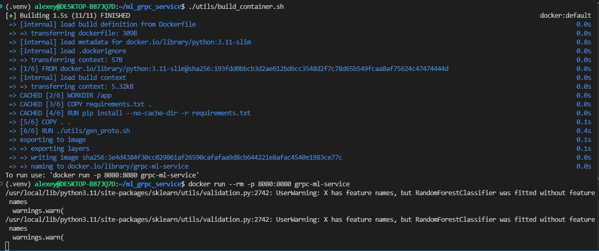
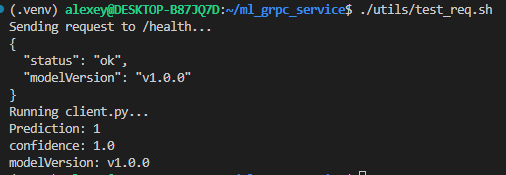

ML gRPC Service
===============

Демонстрационный проект ML-сервиса с использованием gRPC для взаимодействия между клиентом и сервером.

Структура проекта:
```
ml_grpc_service/
 ├── protos/
 │    └── model.proto
 ├── server/
 │    └── server.py
 ├── client/
 │    └── client.py
 ├── models/
 │    └── model.pkl
 ├── requirements.txt
 ├── Dockerfile
 └── README.md
```

## Команды сборки и запуска

### Локальная машина

Сборка и запуск на локальной машине (linux):

```bash
# Установка python-зависимостей
python3 -m venv .venv
source .venv/bin/activate
pip3 install -r requirements.txt
# Генерация proto-модулей python
./utils/gen_proto.sh
# Запуск сервера
python3 server/server.py
# Отправка запросов для теста (другой терминал)
./utils/test_req.sh
```

### Контейнер

Сборка и запуск контейнера:

```bash
# Сборка
./utils/build_container.sh
# Запуск
docker run --rm -p 50051:50051 grpc-ml-service
# Отправка запросов для теста (другой терминал)
./utils/test_req.sh
```

### Примеры вызовов /health и /predict

### Скриншоты вывода команд после запуска контейнера

Сборка и запуск контейнера:


Отправка запросов:

